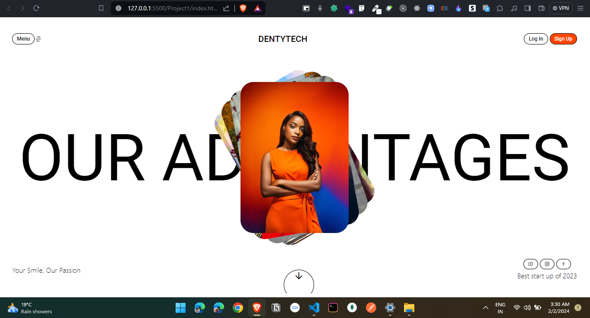
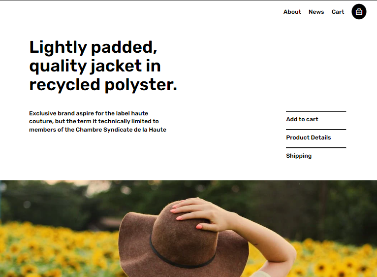
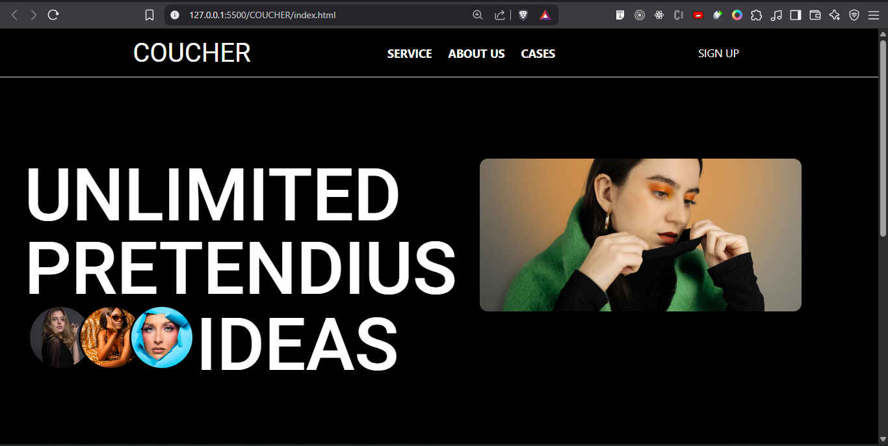
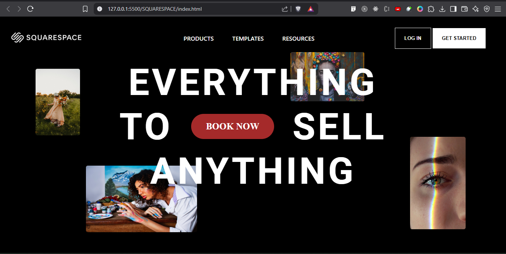

# 💻 Modern Web Design Projects

A curated collection of responsive, interactive, and visually compelling web design projects. Built using modern frontend technologies like **GSAP**, **Framer Motion**, **Three.js**, and **Tailwind CSS**, these projects reflect my passion for clean UI, animation, and frontend craftsmanship.

---

### 🧴 Dentytech Landing Page  
A sleek brand landing page showcasing futuristic UI and smooth transitions.

🔗 [View Project](./DENTYTECH/)  

---

### 🧥 Shop Jacket  
E-commerce jacket store landing page.

🔗 [View Project](./ShopJacket/)  

---

### 🎩 Francesco Gioia  
A bold, editorial-style portfolio website designed for a street and fashion photographer.

🔗 [View Project](./Francesco%20Gioia/)  

---

### 🛋️ COUCHER  
Premium furniture brand website with aesthetic design and motion effects.

🔗 [View Project](./COUCHER/)  

---

### 🧱 SQUARESPACE Clone  
A clean and minimalist custom layout inspired by Squarespace's design system.

🔗 [View Project](./SQUARESPACE/)  

---

> ✨ Built with love, code, and creativity by **Arin Mandal**  
